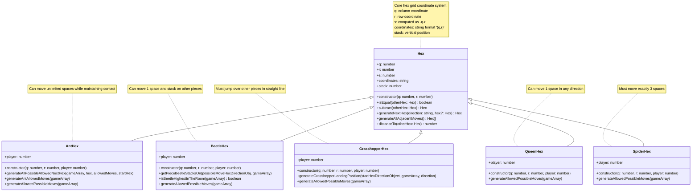

```mermaid
classDiagram
    Hex <|-- AntHex
    Hex <|-- BeetleHex
    Hex <|-- GrasshopperHex
    Hex <|-- QueenHex
    Hex <|-- SpiderHex

    class Hex {
        +q: number
        +r: number
        +s: number
        +coordinates: string
        +stack: number
        +constructor(q: number, r: number)
        +isEqual(otherHex: Hex) boolean
        +subtract(otherHex: Hex) Hex
        +generateNextHex(direction: string, hex?: Hex) Hex
        +generateAllAdjacentMoves() Hex[]
        +distanceTo(otherHex: Hex) number
    }

    class AntHex {
        +player: number
        +constructor(q: number, r: number, player: number)
        +generateAllPossibleAllowedNextHex(gameArray, hex, allowedMoves, startHex)
        +generateAntAllowedMoves(gameArray)
        +generateAllowedPossibleMoves(gameArray)
    }

    class BeetleHex {
        +player: number
        +constructor(q: number, r: number, player: number)
        +getPieceBeetleStacksOn(possibleMoveHexDirectionObj, gameArray)
        +isBeetleHighestInTheRoom(gameArray) boolean
        +generateAllowedPossibleMoves(gameArray)
    }

    class GrasshopperHex {
        +player: number
        +constructor(q: number, r: number, player: number)
        +generateGrasshopperLandingPosition(startHexDirectionObject, gameArray, direction)
        +generateAllowedPossibleMoves(gameArray)
    }

    class QueenHex {
        +player: number
        +constructor(q: number, r: number, player: number)
        +generateAllowedPossibleMoves(gameArray)
    }

    class SpiderHex {
        +player: number
        +constructor(q: number, r: number, player: number)
        +generateAllowedPossibleMoves(gameArray)
    }

    note for AntHex "Can move unlimited spaces while maintaining contact"
    note for BeetleHex "Can move 1 space and stack on other pieces"
    note for GrasshopperHex "Must jump over other pieces in straight line"
    note for QueenHex "Can move 1 space in any direction"
    note for SpiderHex "Must move exactly 3 spaces"

    note for Hex "Core hex grid coordinate system:
        q: column coordinate
        r: row coordinate
        s: computed as -q-r
        coordinates: string format '(q,r)'
        stack: vertical position"
```
